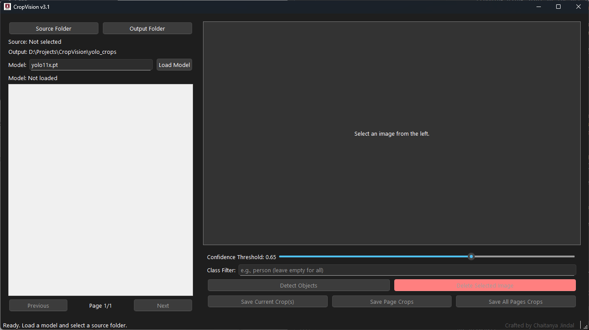

#  Crop Vision ✂️👁️

**Crop Vision** is a user-friendly desktop application designed to streamline the process of object detection and cropping using state-of-the-art YOLO models. Built with Python, PyQt6, and the powerful `ultralytics` library, it provides an interactive interface for selecting images, running detections, visualizing results, and saving precise crops for your datasets or projects.


*(Suggestion: Add a screenshot of your application here and save it as `assets/screenshot.png`)*

---

## ✨ Features

* **Intuitive GUI:** A clean, modern interface built with PyQt6, featuring a resizable layout.
* **Flexible Model Loading:** Load any YOLO model compatible with the `ultralytics` library (e.g., `yolov8n.pt`, custom-trained models).
* **Source/Output Flexibility:** Easily select source directories (including subfolders) and define where to save your crops.
* **Image Browse:** View images as thumbnails with an easy-to-use pagination system.
* **Interactive Preview:**
    * View large previews of selected images.
    * Visualize detection results with bounding boxes, class labels, and confidence scores drawn directly on the image.
* **Detection Control:**
    * Adjust the **confidence threshold** with a slider to filter out weak detections.
    * Filter detections by a specific **class name** (with autocompletion based on the loaded model).
* **Efficient Cropping:**
    * Save crops for a single image.
    * Batch-process and save crops for the current page or *all* images in the source folder.
* **Image Management:** Delete unwanted source images directly from the interface (with confirmation).
* **Responsive & Non-Blocking:** Long operations (model loading, batch processing) run in background threads, keeping the GUI responsive and providing progress updates.
* **Smart Sizing:** Attempts to set a reasonable initial window size based on your screen.

---

## 🚀 Installation

Follow these steps to set up and run Crop Vision on your local machine.

1.  **Prerequisites:**
    * **Python 3.8+**: Ensure you have a compatible Python version installed.
    * **(Optional but Recommended) Git**: For cloning the project.

2.  **Clone the Repository:**
    ```bash
    git clone [Your_Repository_Link]  # Or download and extract the ZIP
    cd crop-vision
    ```

3.  **Create and Activate a Virtual Environment (Highly Recommended):**
    ```bash
    # On macOS/Linux
    python3 -m venv venv
    source venv/bin/activate

    # On Windows
    python -m venv venv
    .\venv\Scripts\activate
    ```

4.  **Install Dependencies:**
    ```bash
    pip install -r requirements.txt
    ```
    ⚠️ **Important Note on PyTorch (torch):**
    The `requirements.txt` file lists `torch`. For **GPU support**, you might need to install a specific version of PyTorch that matches your CUDA toolkit. Visit the [Official PyTorch Website](https://pytorch.org/get-started/locally/) to get the correct installation command for your system and then run it *after* activating your virtual environment.

---

## 💻 How to Use

1.  **Launch the Application:**
    ```bash
    python crop_vision/main.py
    ```
2.  **Load a Model:**
    * Enter the name (e.g., `yolov8n.pt`, it will download if not present) or the full path to your `.pt` model file in the "Model" input field.
    * Click "Load Model". Wait for the confirmation message and status update.
3.  **Select Folders:**
    * Click "Source Folder" and choose the directory containing your images. Thumbnails will appear.
    * Click "Output Folder" to choose where your cropped images will be saved (defaults to `yolo_crops`).
4.  **Browse Images:**
    * Use the "Previous" and "Next" buttons to navigate through pages of thumbnails.
    * Click a thumbnail to display it in the preview pane.
5.  **Run Detection:**
    * Select an image.
    * Adjust the "Confidence Threshold" slider.
    * (Optional) Enter a "Class Filter" name.
    * Click "Detect Objects". Bounding boxes will appear on the preview.
6.  **Save Crops:**
    * **Current:** Click "Save Current Crop(s)" for the image in the preview.
    * **Page:** Click "Save Page Crops" to process all images on the current thumbnail page.
    * **All:** Click "Save All Pages Crops" to process *every* image found in the source folder. A progress bar will appear for batch operations.
7.  **Delete (Use with Caution!):**
    * Select an image.
    * Click "Delete Selected Image". You will be asked for confirmation before the file is permanently removed.

---

## 🛠️ Project Structure

crop-vision/
├── crop_vision/          # Main application package
│   ├── main.py           # Entry point
│   ├── config.py         # Default settings
│   ├── core/             # Backend logic
│   └── gui/              # PyQt6 frontend logic
├── assets/               # Icons, screenshots
├── requirements.txt      # Dependencies
└── README.md             # This file

---

## 🔮 Future Ideas

* [ ] Add support for video processing.
* [ ] Allow drawing/adjusting bounding boxes manually.
* [ ] Implement model training or fine-tuning integration.
* [ ] Add more image preview tools (zoom, pan).
* [ ] Save detection data (e.g., in JSON or XML format).
* [ ] Customizable output filename formats.

---

## 🤝 Contributing

Contributions are welcome! If you have suggestions or find bugs, please open an issue or submit a pull request.

---

## 📜 License

This project is currently unlicensed. Consider adding an open-source license like MIT if you plan to share it widely.

---

## 🧑‍💻 Author

This application was created by Chaitanya Jindal.

https://github.com/JindalChaitanya